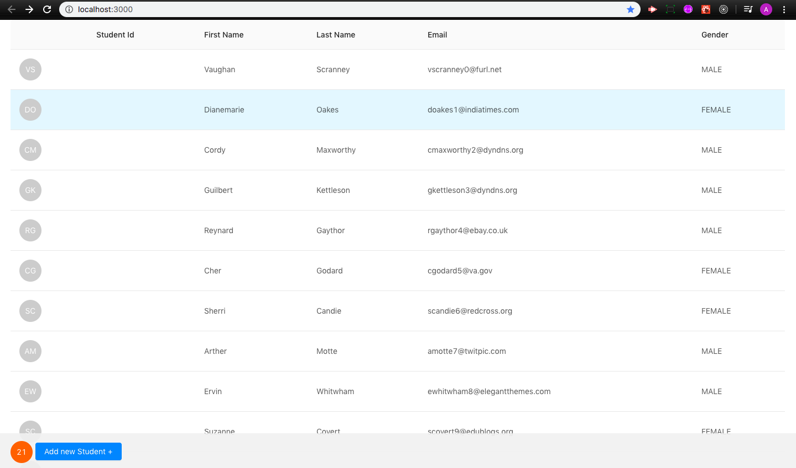
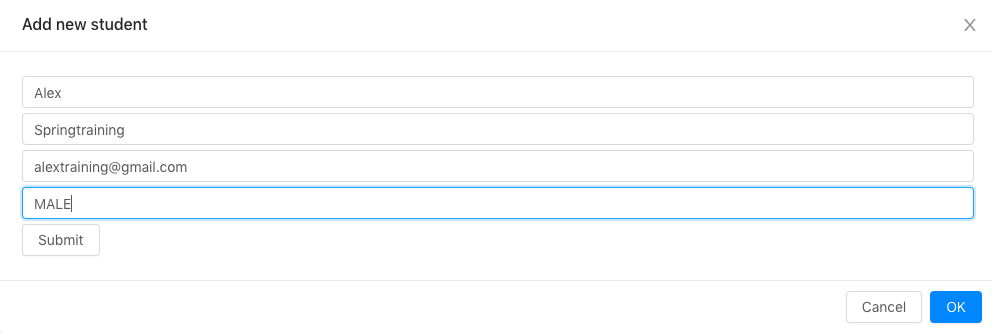
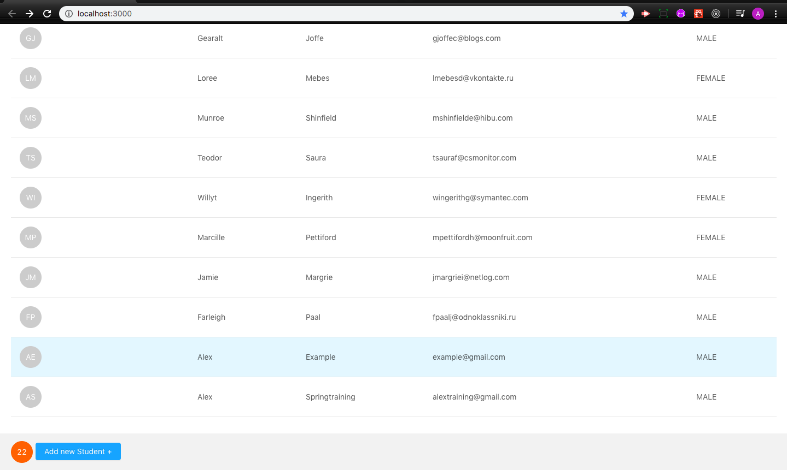
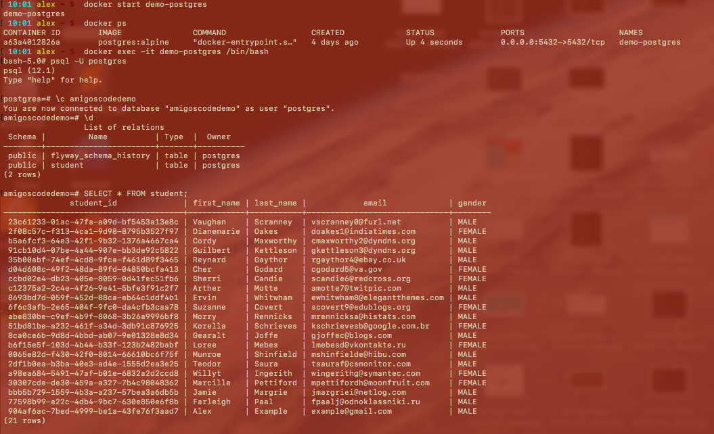
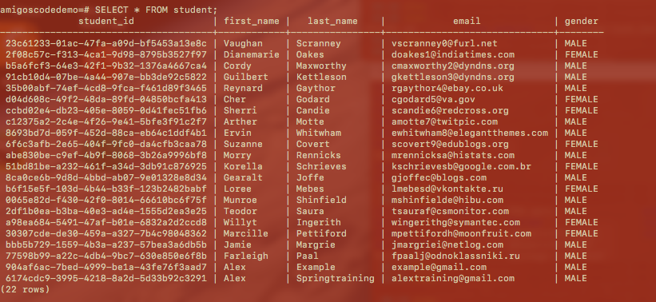

# Student Admin Spring Boot + Java + React JS

 

## Description

Coded through a great demo preapared by Amigos Code. The backend is handled using Spring Boot and
topics such as postgreSQL and Docker are introduced in a very natural way. This version has the apps core functionality of being able to take data from the React front end
pass the data through the database and display the number of entries (students with assorted student info). The course covers
much greater depth and I am currently working through it. 

 

## Run Instructions

The user interface is relatively simple.

The new students can be added by clicking the button in the footer.

Once the form is submitted notice the number of students goes up by one and the student information is on the table

Student information was accessed using Docker and postgreSQL before and after the demo student was added below:
 

 

## This App Utilizes

   * [Java](https://www.oracle.com/technetwork/java/javase/downloads/index.html)
   * [Spring Boot](https://spring.io/guides/gs/spring-boot/)
   * [postgreSQL](https://www.postgresql.org/)
   * [Docker](https://www.docker.com/)

 

## Role in Development

My name is Alex I am a bootcamp student whose portfolio can be found
[here]( https://alexsamalot19.github.io/Samalot-Alexander-Portfolio/).

I am coding my way through this lesson as a way to enhance my understanding of full stack applications.
